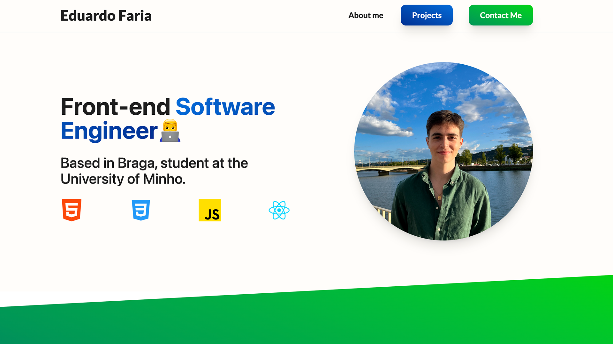

<h1 align="center">Portfolio Website🌱</h1>

## About

This medium solo project has the goal of showcasing my work as a software engineer student. 

## Sections

- Hero: A simple brief introduction
- About Me: A section that contains some key information about me
- Projects: All of my best projects 
- Contact Me: A way to reach me via email

## Preview

## Languages Used

List the programming languages and technologies used in my project:

- Figma
- CSS
- HTML
- React
- TailwindCss

## Final Notes

- **Future Plans**: I plan to continually update and expand this portfolio with new projects and features.

- **Contact**: Feel free to reach out to me if you have any questions, suggestions, or collaboration opportunities. You can contact me via [email](eduardo21faria@gmail.com) or connect on [LinkedIn](https://www.linkedin.com/in/fariaeduardo/).

<h2 align="center">Thank you for visiting my portfolio!🚀</h2>
